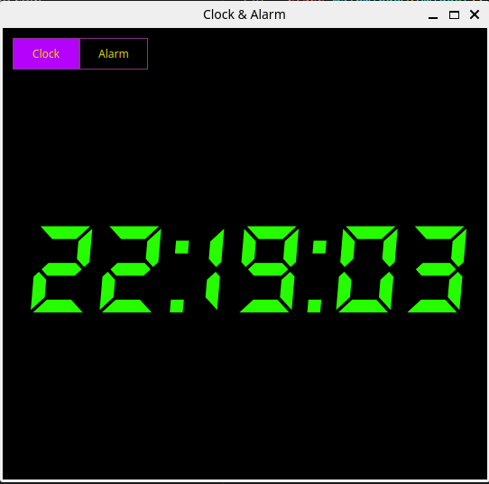
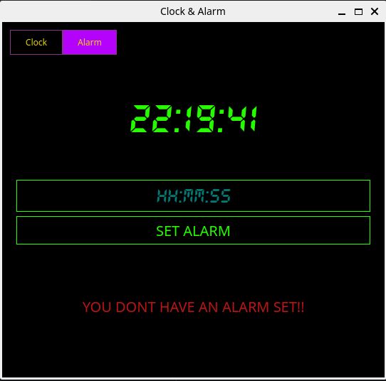
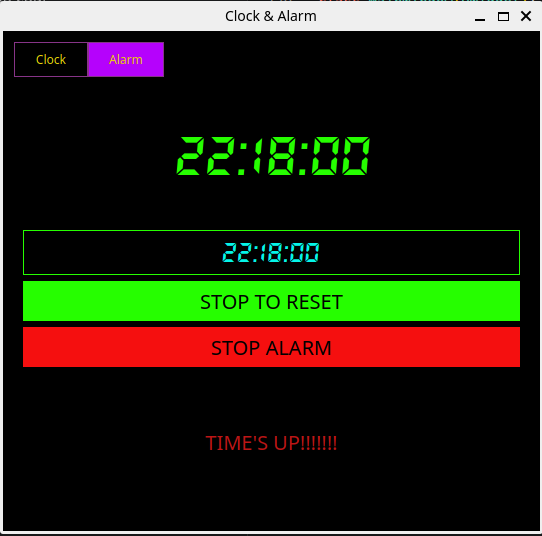

# Clock & Alarm
 
A desktop clock and alarm app built with Python and PyQt5. Switch between a live digital clock and an alarm tab, all in a single tabbed window with a black-and-green digital display theme.
 
## Screenshots
 
<p align="center">
  
  
  
</p>
## How to Run
 
```bash
cd WIDGET_v1
python3 -m venv .venv
source .venv/bin/activate
pip install -r requirements.txt
python3 WIDGET.py
```
 
Make sure `DS-DIGIT.TTF` and `alarm_sound.mp3` are present in the `WIDGET_v1/assets/` folder.
 
## What the App Does
 
- **Clock tab** — displays the live time in 24-hour format, updated every second, styled with a custom digital font.
- **Alarm tab** — lets you type in an alarm time (`HH:MM:SS`) and set it with one click.
- Once set, the app checks the current time every second against the alarm time.
- When the alarm time is reached, it plays a sound using `pygame`, and a **STOP ALARM** button appears to cut the sound early.
- The **SET ALARM** button changes appearance and label depending on state (idle, alarm set, alarm ringing), so it's always clear what stage you're in.
- Everything resets back to normal once the alarm is stopped or finishes playing.
## Built With
 
- Python
- PyQt5
- pygame
